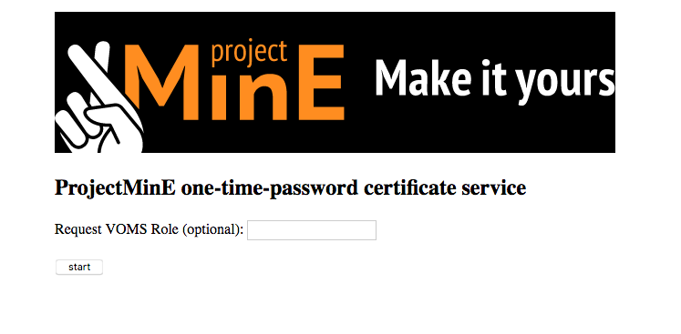
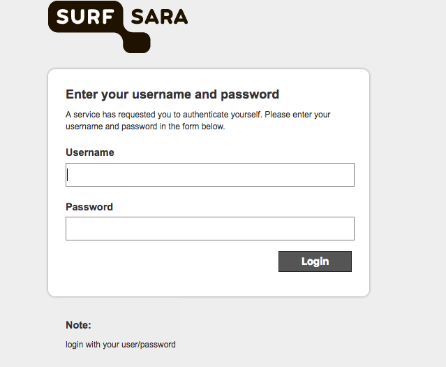
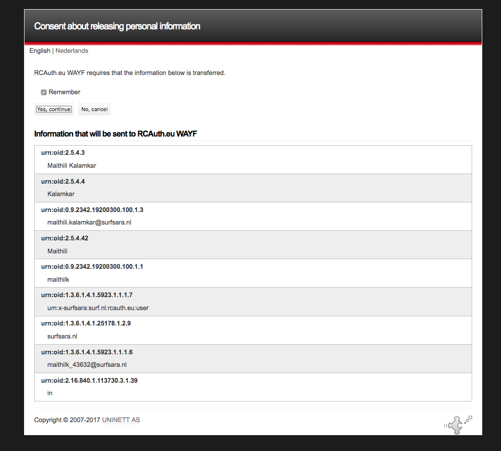
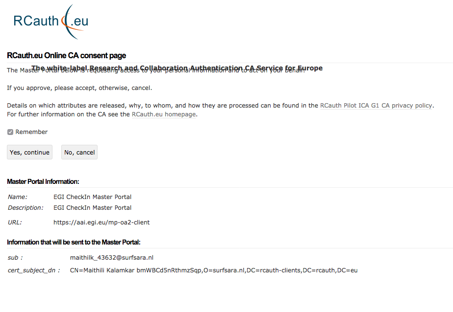
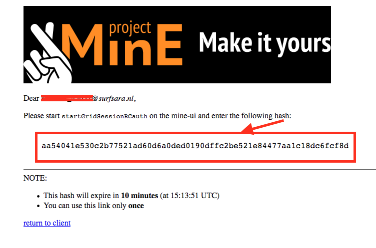

.. _projectmine-rcauth:

******************************
RCauth on Project_MinE User Interface
******************************

===============
RCauth authentication
===============
Users need a personal X509 grid certificate to access the grid and data storage at SURFsara. Each country may have a national Certificate Authority 
(CA) or multiple CAs which support only some Universities/Research Institutes. As this process is decentralized
and every country may not have a CA, this can cause delays for users to get a certificate. The NFS mount service on the mine user interface 
enabled users to copy data from dCache to their local site without a certificate, however these users could not use grid storage clients for more efficient data transfers or run their analyses on the grid.

When users start working on the grid, or interact with dCache for data transfers, a proxy (http://doc.grid.surfsara.nl/en/latest/Pages/Advanced/grid_authentication.html) is created based on the user's 
certificate. RCauth is a service that allows users to get this proxy without the actual user certificate but instead with username/password 
authentication provided by SURFsara. This feature will help users to speed up in getting started without worrying about grid certificates! This document provides information on how to use the RCAuth service.

=============
How to use RCAuth
=============

SURFsara will provide entitlement to enable existing users to use this service. Future incoming users will be automatically  provided with this entitlement when their accounts are created. 

* Create a RCauth proxy
Similar to creating a proxy based on the certificate, you can create a proxy by running the following command:

 .. code-block:: console

     $startGridSessionRCauth lsgrid:/lsgrid/Project_MinE 
     
This will prompt you for the following response:

 .. code-block:: console

    Please enter the authentication hash that you retrieved from https://rcdemo.nikhef.nl/projectmine/ 

From a web browser please proceed to the above link (If you are logging into the mine-ui from a remote server which does not allow X-forwarding, you can also open the link with a browser from your laptop/desktop) You will be directed to the following page:

Click on the start button upon which you will be redirected to the SURFsara portal. 

You need to login with the username and password (the same credentials that provide you access to the SURFsara user portal https://portal.surfsara.nl/home). Once you enter the correct credentials you will be redirected to the following pages for agreeing to the terms and conditions. 

	

Please check remember (so you will not be asked again) and click yes to proceed to the following page:

Copy-paste this 'hash' on the mine-ui which will generate a local proxy (valid for 24 hours) stored on the mine-ui and a proxy with correct voms attributes on the myproxy server (valid for 7 days).

 .. code-block:: console

     $startGridSessionRCauth lsgrid:/lsgrid/Project_MinE 
     You don't have X forwarding enabled. Please go with your browser to https://rcdemo.nikhef.nl/projectmine/?role= to     
     authenticate. Select the 'Research and e-Infrastructures' tab and then 'SURFsara CUA'.

    Please enter the authentication hash that you retrieved from https://rcdemo.nikhef.nl/projectmine/.   
    aa54041e530c2b77521ad60d6a0ded0190dffc2be521e84477aa1c18dc6fcf8d

    Two VOMS proxies have been created:
    - One valid for 7 days, uploaded to the MyProxy server px.grid.sara.nl.
    - One valid for 24 hours, downloaded to /tmp/x509up_uxxxxx.
    Your delegation ID is: userid

This proxy is similar in nature to the proxy created from a grid certificate. The details of the purpose of the proxy, how to retrieve information about the proxy, etc. can be found on the link here - http://doc.grid.surfsara.nl/en/latest/Pages/Advanced/grid_authentication.html

* Renewing a proxy
Please note that the local proxy (/tmp/x509_uxxxxx) is valid only for 24 hours. If you submit jobs from the mine-ui or interact with dCache using the storage clients, make sure the proxy is still valid. If it has expired or will expire sooner than the expected runtime of the jobs you can rerun all the commands above to create a new proxy. A new hash will be generated each time, so you cannot reuse the earlier one. 

If you are submitting jobs with the Picas workflow/other workflows the proxy on the myproxy server is valid for 7 days. You should login to the mine-ui and run the above commands again to renew the proxy also on the myproxy server.

* Other points to note

1. If you already have a grid certificate, you may still continue to use it.

2. RCauth proxy is only enabled for ProjectMinE. If you are involved in other grid projects, you will still need to use the grid certificate.

3. The grid certificate uploaded to a web browser provides you access to several EGI websites e.g., https://goc.egi.eu/portal/ where downtimes on several sites can be tracked. Without the grid certificate, you cannot access these sites anymore. However, you can track the downtimes of sites associated with SURFsara where the project has resource allocation here - http://web.grid.sara.nl/cgi-bin/eInfra.py

4. The proxy creation with grid certificate and RCauth create the local proxy file with the same name (/tmp/x509_uxxxxx). if you created the proxy with one method but wish to switch to the other method, you need to manually remove this proxy file in the /tmp folder. 

